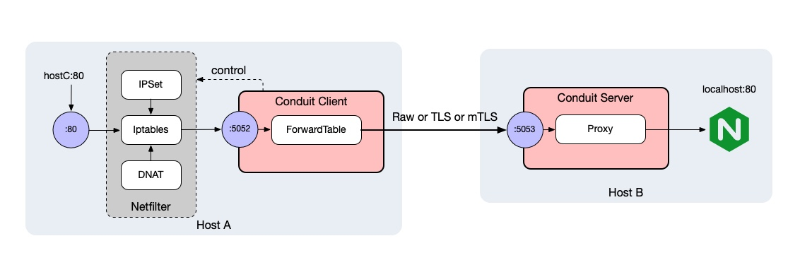
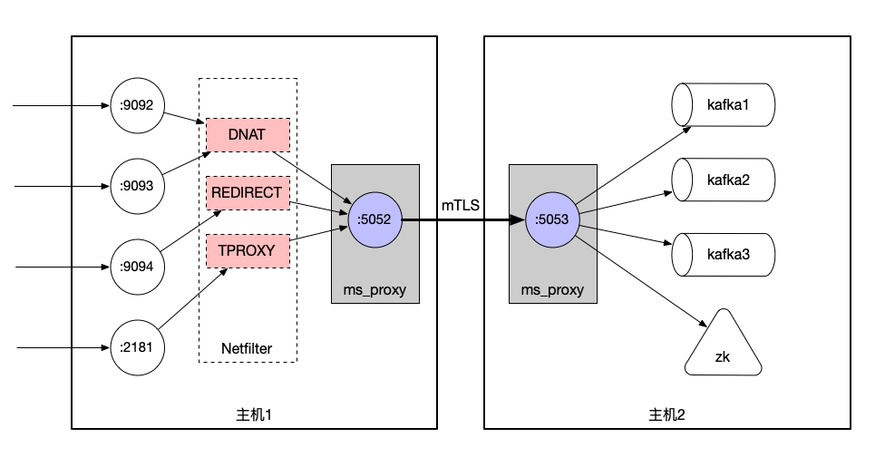

<p align=center>

</p>

<div align="center">

[](https://opensource.org/licenses/Apache-2.0)

</div>

Conduit是一个透明代理Mesh，为你的ToB集群间安全保驾护航。

## 特性

- **集群安全** 支持TLS和mTLS
- **性能无损** 使用Netfilter提供的透明代理，几乎无性能损耗
- **全场景代理** 支持简单Client/Server代理，也支持透明代理Mesh


## 使用

### 1. Client-Server模式




配置做为客户端：

**conduit.yaml**

```yaml
client:
  enable: true
  network: tcp
  listen: 127.0.0.1:5052 # Host A监听
  check_time: 60
  forward_table:
    - dst: :80 # 支持ip:port或者:port
      dst_as: 127.0.0.1:80
      peer_index: 1
  peers:
    - index: 1
      network: tcp
      addresses:
        - 172.168.0.11:5053 # Host B配置

log:
  maxsize: 10
  level: debug
  file: /opt/conduit/log/conduit.log
```

配置做为服务端
**conduit.yaml**

```yaml
server:
  enable: true
  listen:
    network: tcp
    addr: 172.168.0.11:5053 # Host B监听

log:
  maxsize: 10
  level: debug
  file: /opt/conduit/log/conduit.log
```

分别在```Host A```和```Host B```运行两个Conduit

```
/opt/conduit/bin/conduit -c /opt/conduit/conf/conduit.yaml

```

此时所有在```Host A```访问```:80```端口都会经过```Host B(172.168.0.11:5053)```访问到```127.0.0.1:80```

### 2. Mesh模式




Manager配置：

**manager.yaml**

```yaml
conduit_manager:
  listen:
   network: "tcp"
   addr: "0.0.0.0:5051"

db:
  driver: sqlite
  address: /opt/conduit/data/
  db: manager.db
  debug: false

cert: # cert strategy for conduits
  ca:
    not_after: 1,0,0 # 1 year 0 month 0 day
    common_name: "conduit.com"
  cert:
    not_after: 1,0,0
    common_name: "conduit.com"
    organization: "moresec.com"

log:
  maxsize: 10
  level: info
  file: /opt/conduit/log/manager.log
```


配置做为客户端和服务端：

**conduit.yaml**

```yaml
manager:
  enable: true
  dial:
    network: tcp
    addresses:
      - 172.168.0.17:5051

server:
  enable: true
  listen:
    network: tcp
    addr: 172.168.0.11:5053

client:
  enable: true
  network: tcp
  listen: 127.0.0.1:5052
  check_time: 60

log:
  maxsize: 10
  level: debug
  file: /opt/conduit/log/conduit.log
```

在任意一台可达节点部署Manager：

```bash
/opt/conduit/bin/manager -c /opt/conduit/conf/manager.yaml

```

在Host A B C D部署Conduit：

```bash
/opt/conduit/bin/conduit -c /opt/conduit/conf/conduit.yaml

```

配置集群成为一个A B C D互相访问都走mTLS通道的透明代理Mesh。


## Q&A

1. Conduit会影响我的iptables表吗

Conduit独立建立了CONDUIT Chain，只有命中了ipset的才会进入透明代理。并且在正常退出后，会清除所有规则。

```
-A PREROUTING -i br+ -j CONDUIT
-A OUTPUT -p tcp -m mark --mark 0x5a4 -j ACCEPT
-A OUTPUT ! -o br+ -j CONDUIT
-A CONDUIT -p tcp -m set --match-set CONDUIT_IPPORT dst,dst -j MARK --set-xmark 0x5a6/0xffffffff
-A CONDUIT -p tcp -m set --match-set CONDUIT_PORT dst -j MARK --set-xmark 0x5a7/0xffffffff
-A CONDUIT -p tcp -m set --match-set CONDUIT_IP dst -j MARK --set-xmark 0x5a5/0xffffffff
-A CONDUIT -p tcp -m set --match-set CONDUIT_IPPORT dst,dst -j DNAT --to-destination 127.0.0.1:5052
-A CONDUIT -p tcp -m set --match-set CONDUIT_PORT dst -j DNAT --to-destination 127.0.0.1:5052
-A CONDUIT -p tcp -m set --match-set CONDUIT_IP dst -j DNAT --to-destination 127.0.0.1:5052
```

2. 性能怎么样

使用iperf可以打满带宽

```
-----------------------------------------------------------
Server listening on 80
-----------------------------------------------------------
Accepted connection from 127.0.0.1, port 47363
[  5] local 127.0.0.1 port 80 connected to 127.0.0.1 port 47364
[ ID] Interval           Transfer     Bandwidth
[  5]   0.00-1.00   sec   311 MBytes  2.61 Gbits/sec
[  5]   1.00-2.00   sec   322 MBytes  2.70 Gbits/sec
[  5]   2.00-3.00   sec   312 MBytes  2.61 Gbits/sec
[  5]   3.00-4.00   sec   318 MBytes  2.67 Gbits/sec
[  5]   4.00-5.00   sec   304 MBytes  2.55 Gbits/sec
[  5]   5.00-6.00   sec   326 MBytes  2.74 Gbits/sec
[  5]   6.00-7.00   sec   330 MBytes  2.77 Gbits/sec
[  5]   7.00-8.00   sec   326 MBytes  2.74 Gbits/sec
[  5]   8.00-9.00   sec   320 MBytes  2.68 Gbits/sec
[  5]   9.00-10.00  sec   318 MBytes  2.67 Gbits/sec
...
```

3. 适用于什么场景

* ToB交付产品时，经常需要暴露mysql/redis端口，但是历史原因没有配置tls，可以使用Conduit来接管安全
* 没有微隔离，但是需要把几台主机流量隔离起来，可以使用Conduit来构成Mesh网络
* 不希望对外端口开放过多，可以使用Conduit做为代理使用

4. 为什么会给流量打Mark

为了防止Conduit发出的流量又被iptables劫持，所以使用Mark来忽略。

5. 我需要开通fw_mark吗

fw_mark是为了iptables的mark在socket接收时能够查到这个mark，以快速确定匹配了哪个ipset，如果没有也没关系，会多一层判断


Released under the [Apache License 2.0](https://github.com/moresec-io/conduit/blob/main/LICENSE)