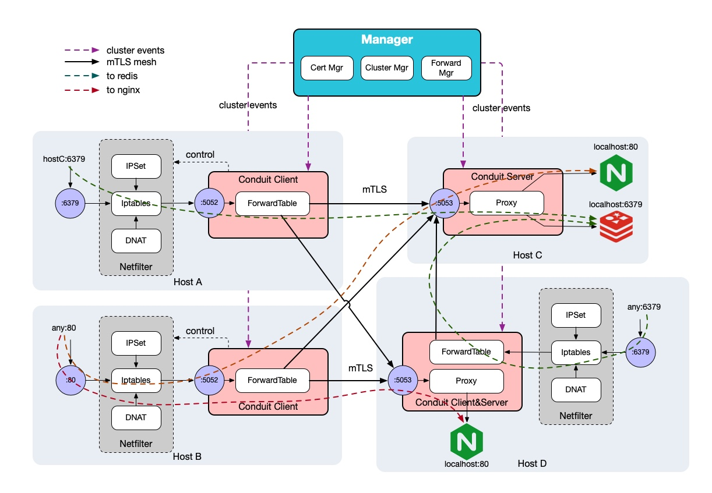

Conduit是一个透明代理Mesh，为你的ToB集群间安全保驾护航。

## 特性

- **集群安全** 支持TLS和mTLS
- **性能无损** 使用Netfilter提供的透明代理，几乎无性能损耗
- **全场景代理** 支持简单Client/Server代理，也支持透明代理Mesh

## 架构：

## 使用

### Client-Server

### Mesh

## 部署

### 构建安装包

### 安装